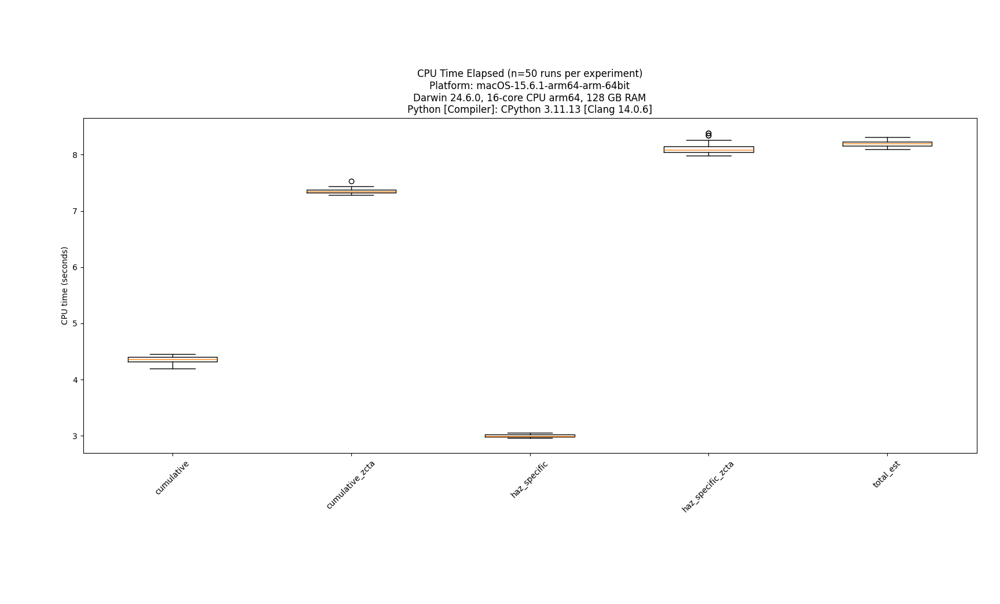
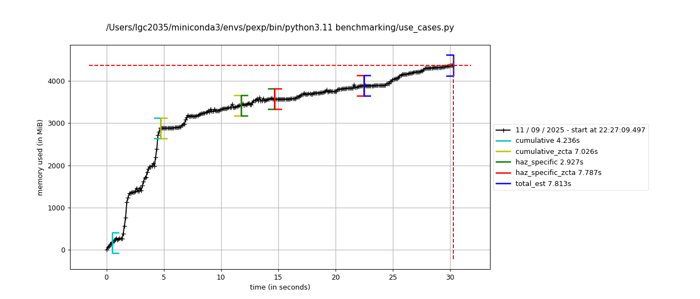

# Benchmarking `popexposure`

The benchmarking directory contains files enabling quick-and-dirty benchmarking of `popexposure` functions, both in terms of speed (CPU processing time), as well as memory consumption. Benchmarking is done using the tutorial data, analyzing populations exposed to CA wildfires from 2016-2018.

## CPU processing time

To benchmark the CPU processing time for various use cases for `popexposure` (contained in [use_cases.py](use_cases.py)), run the below from the root directory of the `popexposure` repository:

```bash
# Ensure you are in the root dir of popexposure repo before running:
# -f specifies the file to benchmark
# -n specifies the number of times to run benchmarks
python benchmarking/benchmark.py -f benchmarking/use_cases.py -n 50
```

You can save the resulting plot to the [plots](plots/) directory.

## Memory consumption

To benchmark the memory consumption with [memory_profiler](https://github.com/pythonprofilers/memory_profiler), first uncomment all of the `@profile` decorators in the [use_cases.py](use_cases.py) script, then run the below from the root directory of the `popexposure` repository:

```bash
# Ensure you are in the root dir of popexposure repo before running:
mprof run benchmarking/use_cases.py
mprof plot
```

You can save the resulting plot to the [plots](plots/) directory.

Alternatively, if you want to output line-by-line memory profiling, you can uncomment the `@profile` decorators as well as add the following import statement to [use_cases.py](use_cases.py):

```python
from memory_profiler import profile
```

and then simply call:

```bash
# Ensure you are in the root dir of popexposure repo before running:
mprof run use_cases.py
```

## Results

### Nov 2024 Apple MacBook Pro with M4 Max chip, 128 GB RAM



